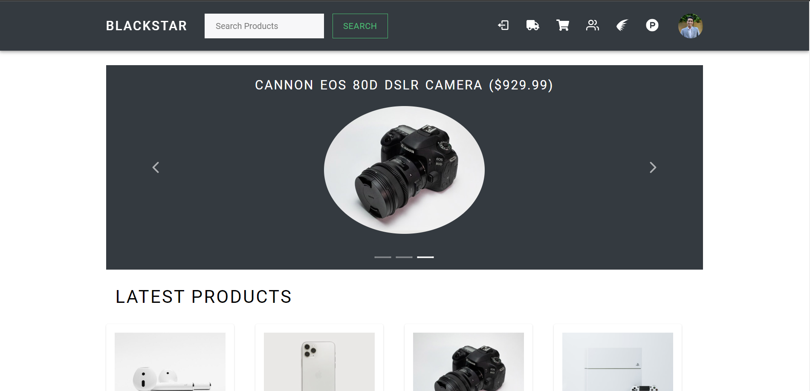
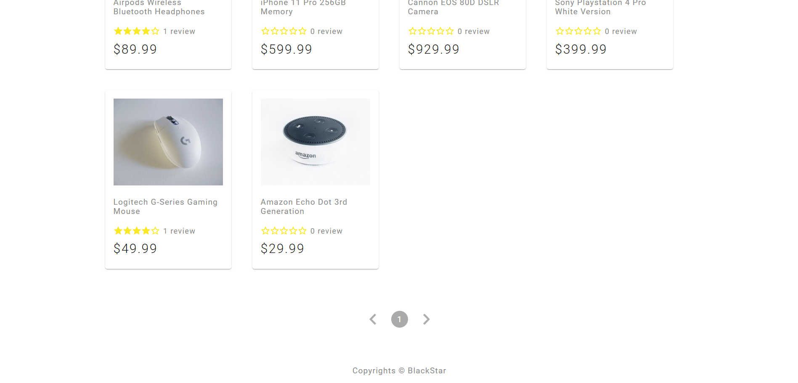
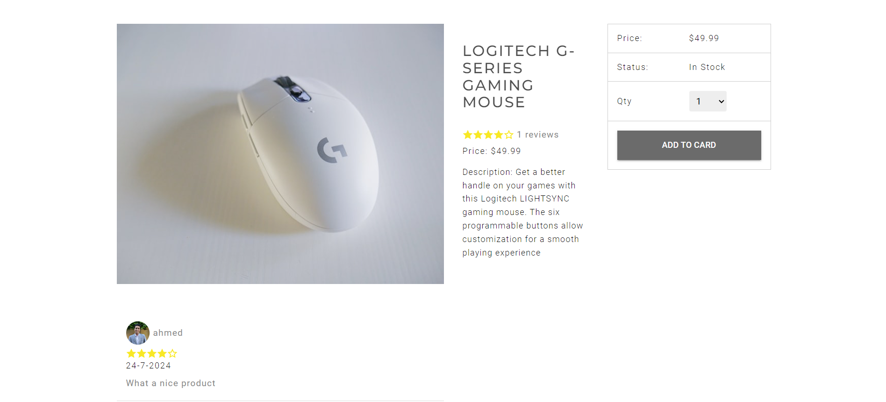
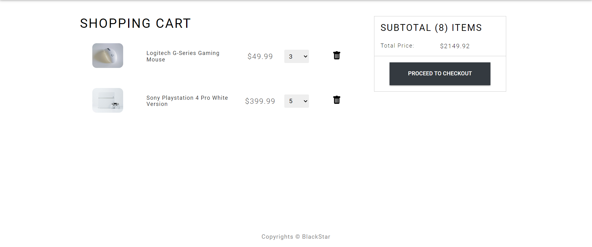
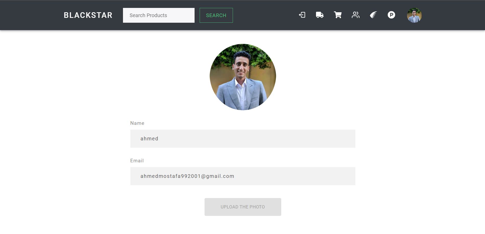
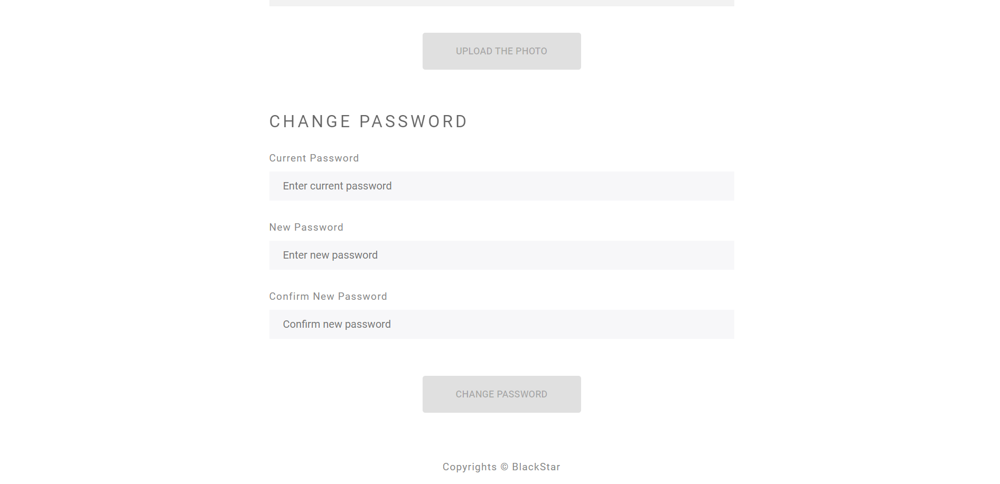
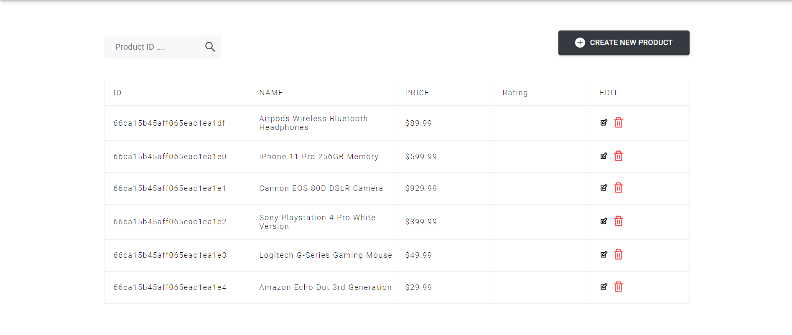
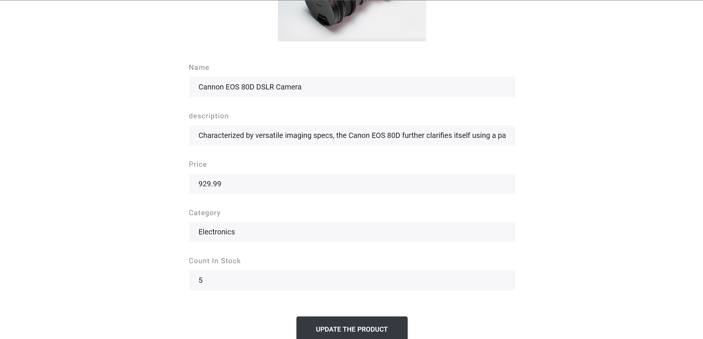
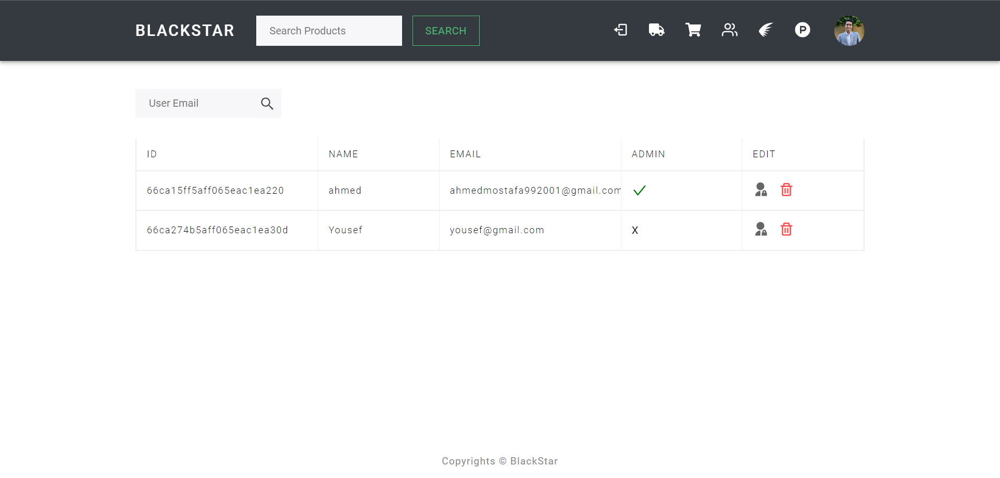
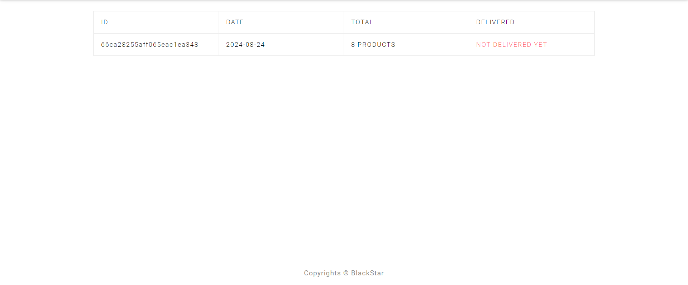

# Blackstar Shop

Blackstar Shop is a full-stack ecommerce application designed for both administrators and customers. Administrators can manage products, users, inventory, and deliveries, while customers can browse and purchase products using Stripe, maintain their profiles, view their cart, and track order statuses.

## Table of Contents

1. [Running the Application](#running-the-application)
2. [Features](#features)
3. [Technology Stack](#technology-stack)
4. [Examples from Pages](#examples-from-pages)

## Running the Application

To get the application up and running on your local machine, follow these steps:

1. **Prerequisites**: Ensure Docker is installed on your system.
2. **Clone the Repository**:
3. **Navigate to the Project Directory**:
4. **Launch the Application**:

   ```
   docker compose up
   ```
5. **Access the App**:
   Access the application by navigating to \`http://localhost:3000\` in your web browser.

## Features

### Admin Features

- **Product Management**: Add, update, and remove products from the catalog.
- **User Management**: Manage user accounts, including viewing, updating, and deleting users.
- **Inventory Management**: Track stock levels, update quantities, and manage product availability.
- **Delivery Management**: Oversee and update delivery statuses for customer orders.

### Customer Features

- **Product Browsing and Purchasing**: Browse products and make purchases using Stripe for payment processing.
- **Account Management**: Maintain and update personal profile details.
- **Cart Management**: Add, update, and remove items from the cart.
- **Order Tracking**: View the status of current and past orders.

## Technology Stack

### Backend

- **Express.js**: Fast, unopinionated, minimalist web framework for Node.js.
- **Mongoose**: Elegant MongoDB object modeling for Node.js.
- **JWT (jsonwebtoken)**: Used for secure authentication.
- **Stripe**: Payment processing platform.

### Frontend

- **React.js**: A JavaScript library for building user interfaces.
- **Redux Toolkit**: State management tool.
- **Material-UI**: React components for faster and easier web development.

## Examples from Pages

### Home





### Product Page



### Cart



### Profile





### Admin Product Management Page



### Admin Update Product



### Admin User Management



### Delivery Status


